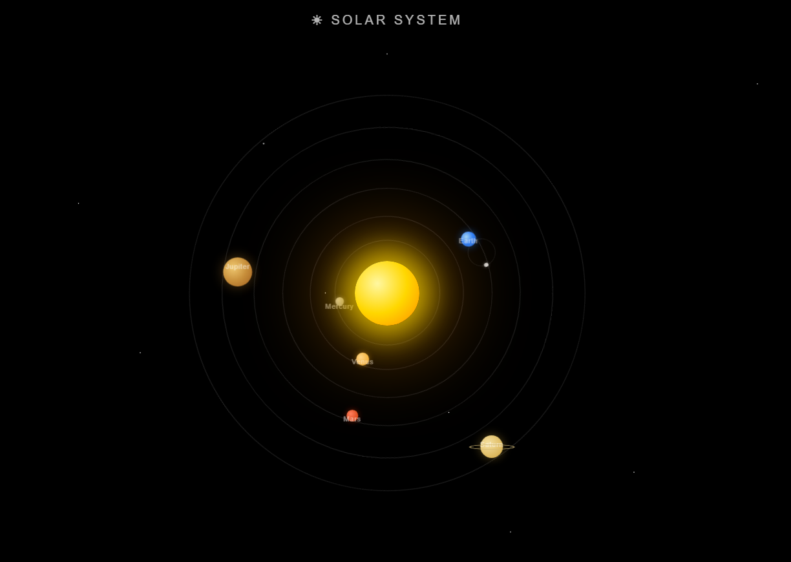

# 🌌 Solar System Animation

A beautiful Solar System Animation built using HTML, CSS, and JavaScript.

## 📸 Screenshot




## ✨ Features

- ☀️ Glowing Sun
- 🪐 Orbiting Planets
- 🌍 Earth with Moon
- 🌟 Space Background
- 🎨 Smooth CSS Animations
- 📱 Responsive Design

## 🛠️ Technologies Used

- HTML5
- CSS3
- JavaScript

## 📂 Project Structure

```text
Solar-System/
│
├── index.html
├── style.css
├── script.js
└── README.md
```

## 📸 Preview

Solar System animation showing planets revolving around the Sun.

## 🎯 Learning Outcomes

- CSS Animations
- Orbit Effects
- Keyframes
- Frontend Development
- Responsive Design

## 👨‍💻 Author

**Pushpraj Kumar**

GitHub: https://github.com/pushprajkumar640-lang

LinkedIn: https://www.linkedin.com/in/pushpraj-kumar-89573a383

⭐ If you like this project, give it a star!
